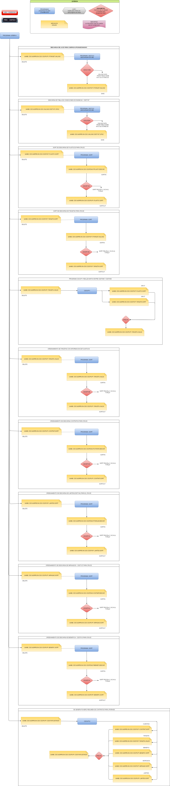

## DATOS IMPORTANTE
JOB trabajo   : CDOEDCKD
PROC procesos : CDOPDCK

### Lista de programas:
- IEFBR14: para manipulacion de databasets
lista de archivos:
- (Pendiente)

### Decarga la db para campaña upgrade masivo
- Hace un drop del dataset 
- Decarga de una base de datos de DB2 con INZUTIL5 -> IBM DB2 Utilities Suite
- (Pendiente)

## Herramienta para poder ver drawio

- Instalado abrir el archivo: **CDOEDCKD.drawio**

## MAPEO AVANCE 1/08
